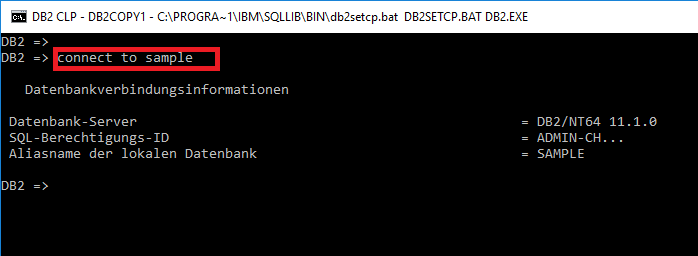
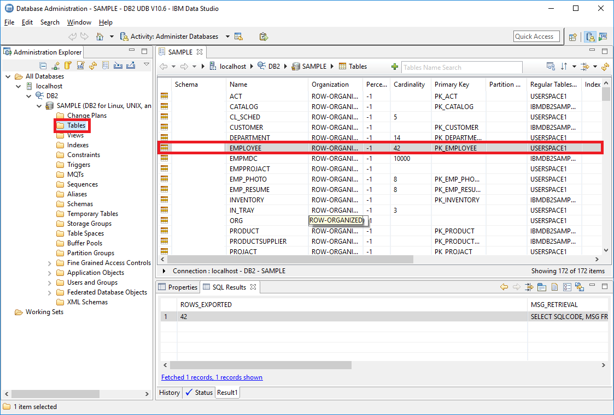
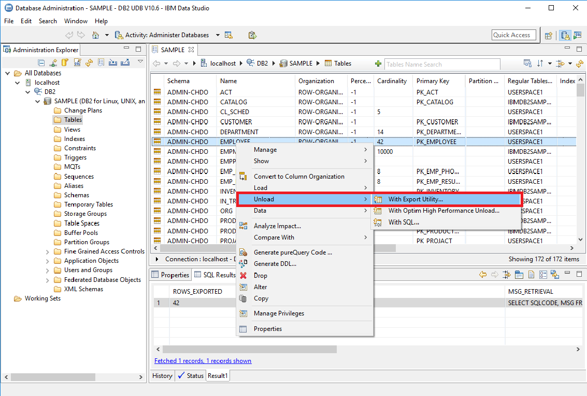
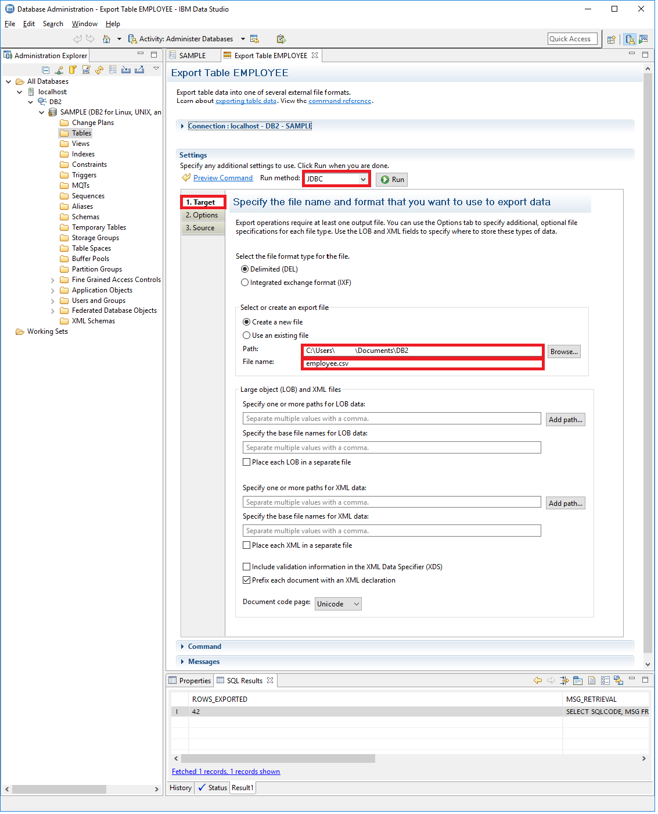
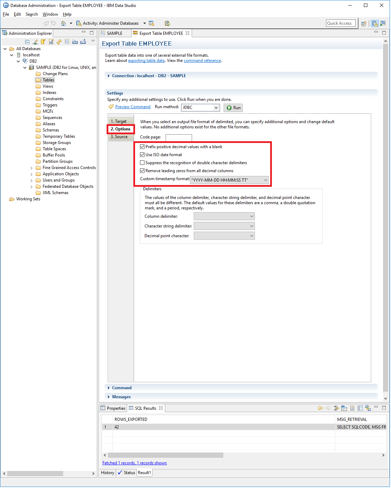
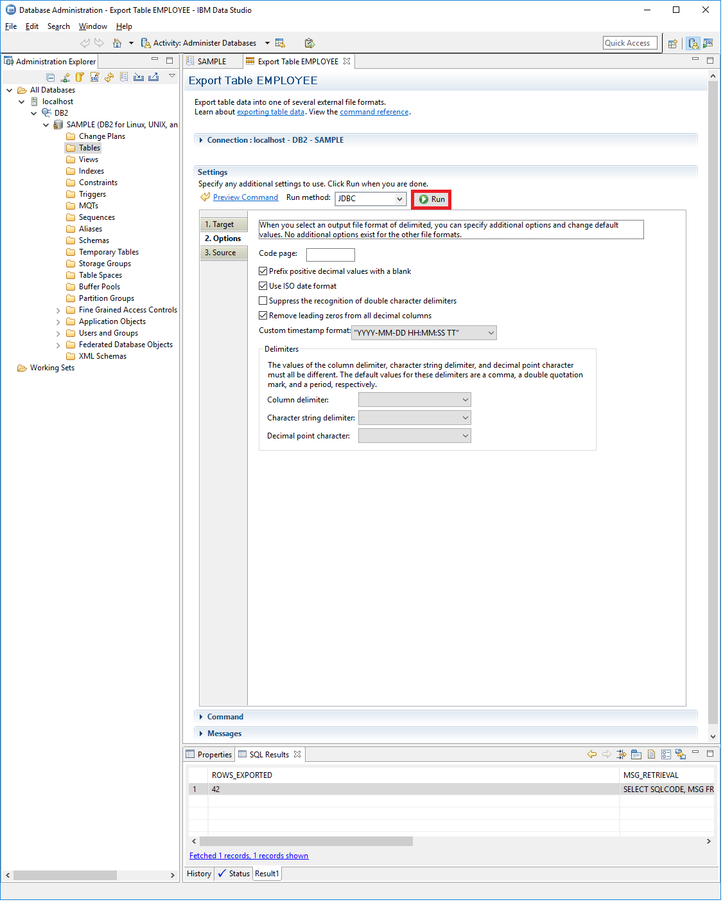

# Proper csv export from IBM DB2 
We want to show you how to export CSV files from IBM DB2. Use one of the following options.

## Option 1: Using the IBM command line processor

* Connect to the database you want to export.   

* Use the ***EXPORT TO***-command combined with a ***SELECT*** query to export a table  
(Documentation:<https://www.ibm.com/support/knowledgecenter/SSEPGG_9.8.0/com.ibm.db2.luw.admin.cmd.doc/doc/r0008303.html>)
* We recommend applying the following parameters to ensure compatible formatting for your exported csv file:  
o***MODIFIED BY dates***  
-> exports dates in ISO format (YYYY-MM-DD)  
o***MODIFIED BY timestampformat=”YYYY-MM-DD HH:MM:SS”***  
-> exports timestamps in the selected format  
o***COALESCE(column,’’)***  
-> checks if the content of the data field equals***NULL***and replaces it with “” (empty string) if necessary.  
This addition is needed for every selected column that allows***NULL***values.

Example:

Additional Notes:

* ***IBM command line processor***automatically masks double quotes ("Example" -> ""Example"")

## Option 2: Using the***IBM Data Studio***

* Connect to the database you want to export
* Select the table you want to export  

* Open context menu by right-clicking on the table
* Select the option***Unload***->***With Export Utility***to open the integrated export tool  

* Select***JDBC***as***Run method***
* Pick your path and file name for the csv file  

* To specify additional options, select the tab called***Options***(top left)
* To ensure a compatible format for your csv file, you should check the available control boxes as follows  

* Click ***Run*** to start exporting the table  

* You will find the csv file in your selected path

Additional Notes:

* ***IBM Data Studio***automatically converts***NULL***to "" (empty string)
* ***IBM Data Studio***automatically masks double quotes ("Example" -> ""Example"")

   
Feel free to leave a comment and give us feedback!

