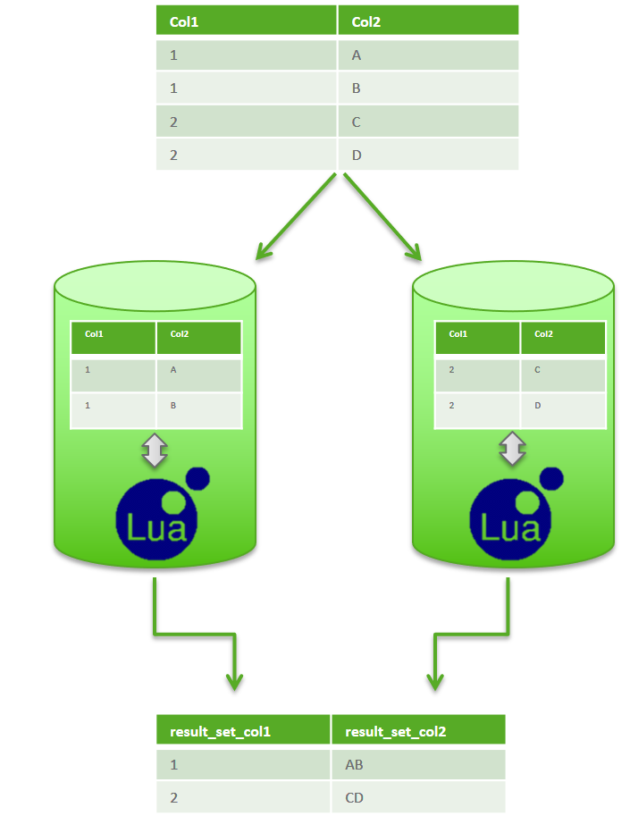

# How to create and use UDFs 
## Background

This is a basic tutorial on User Defined Functions. For details regarding the programming languages see our [documentation portal](https://docs.exasol.com) More technical insight is also given in the white paper["Big Data Science - the future of analytics"](https://www.exasol.com/en/community/resources/resource/big-data-science-the-future-of-analytics/).

We have to distinguish between UDFs and control scripts in the following ways:


|  |  |
| --- | --- |
| **Control Scripts (Lua)** | **User Defined Functions (UDFs)** |
| for control jobs | for operations on data sets |
| written in Lua | written in SQL, Lua, Java, Python, R, or any other defined language |
| executed via SQL statement: 'EXECUTE SCRIPT ...' | executed within SQL 'SELECT' statement, e.g. 'SELECT udf(col1, col2) FROM tbl1;' |
| supports executing of SQL statements & SQL error handling | supports loading of Java / Python / R packages |
| runs iteratively & single threaded on one node | runs massively parallel |

## How to create a UDF

Creating a UDF is as simple as creating a script in the database.

## Step 1

You should decide what language you want to create the script in and what kind of script it is (Scalar/Set). 


|  |
| --- |
| **Input Values** |
| SCALAR | The keyword SCALAR specifies that the script processes single input rows. It's code is therefore called once per input row. |
| SET | If you define the option SET, then the processing refers to a set of input values. Within the code, you can iterate through those values (for more information, see[**Examples**](https://docs.exasol.com/database_concepts/udf_scripts/lua_examples.htm)). |
| **Output Values** |
| RETURNS | In this case the script returns a single value. |
| EMITS | If the keyword EMITS was defined, the script can create (emit) multiple result rows (tuples). In case of input type SET, the EMITS result can only be used alone, thus not be combined with other expressions. However, you can nest it through a subselect to do further processing of those intermediate results. |

You can use the [script signature generator](https://docs.exasol.com/database_concepts/udf_script_signature_generator.html) to help create the syntax for the header

## Step 2

Write your script in the database - we'll do a simple one for this example:


```markup
--/ 
create or replace R scalar script Rsquare(x int) returns int as  
run <- function(ctx) {     
 ctx$x * ctx$x 
} 
/
```
## Step 3

Test out your script by running it like below:


```markup
select Rsquare(3); 
```
You should get '9' as the result. 

## Additional Notes

## Parallelism

Tables are stored in EXASOL row-wise distributed across a cluster's nodes. A UDF environment runs "sandboxed" on each node, computing a local result set integrated into EXASOL's SQL pipeline (see white paper:["A peek under the hood"](https://www.exasol.com/en/community/resources/resource/a-peek-under-the-hood/)). The local result sets are sent to the node handling the client connection and merged to the global result set to be sent to the client.



## Scalar UDFs

A scalar UDF computes on one input row per UDF instance and returns one output row. It is automatically executed in massively parallel in the Exasol cluster. The example below demonstrates this:


```markup
reate or replace table t (x int, y int);  
insert into t values(1,1),(1,2),(4,2);  
select * from t; 

--/ 
CREATE OR REPLACE LUA SCALAR SCRIPT my_maximum (a DOUBLE, b DOUBLE) RETURNS DOUBLE AS  
function run(ctx)     
 if ctx.a == nul or ctx.b == null then         
  return null     
 end     
 if ctx.a > ctx.b then         
  return ctx.a     
 else         
  return ctx.b     
 end 
end 
/  

SELECT x, y, my_maximum(x, y) from t;
```
## Aggregate UDFs

An aggregate UDF consumes multiple input tuples, i.e. the whole columns of the table or the group if a GROUP BY clause is defined in the SELECT statement. One UDF instance returns one single value.

The number of UDF instances to be started is handled by the GROUP BY clause. Without a GROUP BY clause one instance is started which runs on one node, not in parallel. A GROUP BY clause that results in multiple groups causes multiple UDF instances, which are then computed massively parallel in Exasol. Please see the following example:


```markup
--/ 
CREATE OR REPLACE LUA SET SCRIPT my_average (a DOUBLE) RETURNS DOUBLE AS  
function run(ctx)     
 if ctx.size() == 0 then         
  return null     
 else         
  local sum = 0         
 repeat             
  if ctx.a ~= null then                 
   sum = sum + ctx.a             
  end         
 until not ctx.next()         
 return sum/ctx.size()     
 end 
end 
/  

SELECT my_average(x), my_average(y) from t;
```
## Analytical UDFs

These consume as input values multiple data tuples (rows), and they also return a result set containing multiple rows. Parallelism is handled by the GROUP BY (see above).

In the following example, a running sum is computed. Notice that the simple algorithm iterates through the entire input set within one instance (repeat loop).


```markup
--/ 
CREATE OR REPLACE LUA SET SCRIPT my_sum ( a DOUBLE)    
EMITS (count DOUBLE, val DOUBLE, sum DOUBLE) AS      
function run(ctx)       
 local sum  = 0       
 local count = 0       
 repeat           
  if ctx.a ~= null then               
   sum = sum + ctx.a               
   count = count +1               
   ctx.emit(count, ctx.a, sum)           
  end       
 until not ctx.next()   
end 
/    

SELECT my_sum(x ORDER BY x) from t;
```
You can find all of these examples in the attached file. 

## Additional References

* [Debug UDF outputs](https://docs.exasol.com/database_concepts/udf_scripts/debug_udf_script_output.htm)
* [UDF Scripts](https://docs.exasol.com/database_concepts/udf_scripts.htm)
* [UDF Script Signature Generator](https://docs.exasol.com/database_concepts/udf_script_signature_generator.html)
* [Expanding Script Languages Using BucketFS](https://docs.exasol.com/database_concepts/udf_scripts/expand_script_using_bucketfs.htm)
* [BucketFS](https://docs.exasol.com/database_concepts/bucketfs/bucketfs.htm)
