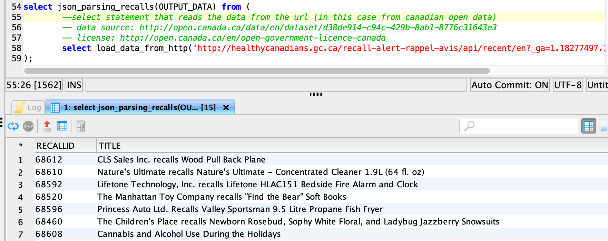

# Parsing JSON data with python 
## Background

This solution is an example of how to load and parse[JSON](https://en.wikipedia.org/wiki/JSON)data with a simple SQL Statement within EXASOL. In this case, the integrated python user-defined functions (UDFs) in combination with[the python JSON library](https://docs.python.org/2/library/json.html)are used. Additional JSON feature content can also be found here: <https://community.exasol.com/t5/discussion-forum/sneakpreview-on-version-7-json-functions/m-p/1710>.

## Prerequisites

First of all, we create a small script to load data from a URL:


```"code-java"
--small script to load data from an url and optionally split the data based on newlines
--/
create or replace python scalar script load_data_from_http
(url varchar(500),split_on_newline boolean) emits (output_data varchar(2000000)) as
def run(ctx):
	import urllib2
	response = urllib2.urlopen(ctx.url)
	data = response.read()
	if ctx.split_on_newline == True:
		lines = data.split('\n')
		for line in lines:
			if len(line) > 1:
				ctx.emit(line)
	else:
		ctx.emit(data)
/
```
This script will give you a varchar(2000000) field called OUTPUT_DATA with the content of the file.  
In this example we load JSON data from[the Canadian Recalls and Safety Alerts](http://open.canada.ca/data/en/dataset/d38de914-c94c-429b-8ab1-8776c31643e3)Dataset. You'll find the license[here](http://open.canada.ca/en/open-government-licence-canada).

## How to parse the JSON data.

The following script is an example and was created to parse the JSON file of[the Canadian Recalls and Safety Alerts](http://open.canada.ca/data/en/dataset/d38de914-c94c-429b-8ab1-8776c31643e3).  
Please adjust it to your needs / your JSON file. In the EMITS section, you can define the output you want and in the run function, you define how the data is parsed.

## Step 1

With ctx.emit you'll add a row to the result of this function.


```"code-java"
--this is an example script to parse JSON (INPUT). Please adjust it to your json-format
--try/except to handle missing values and emit null instead
--/
create or replace python scalar script json_parsing_recalls("INPUT" varchar(2000000)) 
emits (recallid varchar(50), title varchar(1000), category varchar(100), date_published int, url varchar(100)) as
import json
def run(ctx):
	j = json.loads(ctx.INPUT)
	for x in range(0,len(j['results']['ALL'])):
		try:
			recallId = j['results']['ALL'][x]['recallId']
		except KeyError:
			recallId = None
		try:
			title = j['results']['ALL'][x]['title']
		except KeyError:
			title = None
		try:
			category = ','.join(j['results']['ALL'][x]['category'])
		except KeyError:
			category = None
		try:
			date_published = j['results']['ALL'][x]['date_published']
		except KeyError:
			date_published = None
		try:
			url = j['results']['ALL'][x]['url']
		except KeyError:
			date_published = None
		ctx.emit(recallId,title,category,date_published,url)
/
```
## Step 2

Now you can use both scripts also nested to load and parse the data. The inner select first loads the data and the outer select parses the output.


```"code-sql"
select json_parsing_recalls(OUTPUT_DATA) from (
	--select statement that reads the data from the url (in this case from canadian open data)
	-- data source: http://open.canada.ca/data/en/dataset/d38de914-c94c-429b-8ab1-8776c31643e3
	-- license: http://open.canada.ca/en/open-government-licence-canada
	select load_data_from_http('http://healthycanadians.gc.ca/recall-alert-rappel-avis/api/recent/en?_ga=1.18277497.1100922614.1438786533',false)
);
```
This will give you a resultset with the parsed json data:



## Additional Notes

The script to load data from a URL in this simple example is limited to a maximum of 2 million characters per file or line (because of the varchar(2000000) in the definition). If you have longer JSON-objects, feel free to adjust it to your needs by e.g. combining the functions into one.

## Additional References

<https://docs.exasol.com/sql_references/functions/alphabeticallistfunctions/json_value.htm>

<https://docs.exasol.com/sql_references/functions/json_path_expressions.htm>

<https://docs.exasol.com/database_concepts/udf_scripts/python.htm>

<https://community.exasol.com/t5/discussion-forum/sneakpreview-on-version-7-json-functions/m-p/1710>

