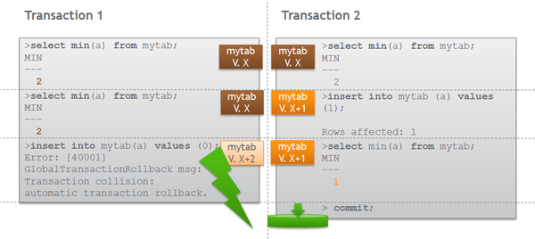
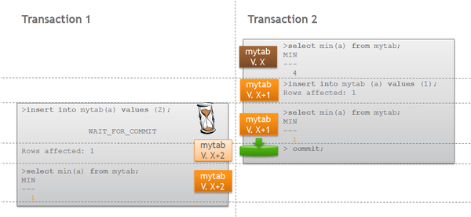

# Transaction System 
## Background

Multiuser compliance of a database system is ensured by its transaction system. A transaction consists of multiple SQL commands and is either completed with a COMMIT statement or aborted with a ROLLBACK statement.

An effective Transaction Management System allows the following:

* Every transaction returns a correct result!
* All users can run their transactions in parallel!
* The database remains consistent!

## Explanation

## What are the basic rules for transactions?

The transaction management system ensures the adherence of the ACID rules:

* Atomicity: A transaction is either manifested in its entirety or not at all. No partial modifications are saved in the database.
* Consistency: A transaction transfers the database from one consistent state into another consistent state and thus ensures the consistency of the database.
* Isolation: A transaction is executed as if it was the only transaction within the whole system.
* Durability: All changes made by a transaction that is successfully committed are durable.

All transactions are supervised by the transaction management system, which automatically solves conflicts that might arise between concurrent transactions. This can lead to delayed transactions or forced rollbacks.

## Is the TMS of EXASolution comparable to other systems?

Some database management systems have only a partial implementation of the transaction model. Especially schema statements like CREATE SCHEMA or CREATE TABLE are sometimes instantly written to the database and the changes published to already running transactions.

* **PRO:** Fewer collisions with parallel transactions
* **CON:** Some changes cannot be rolled back and immediately impact other users or processes.

## Which operations in EXASolution follow the ACID concept?

All database operations in EXASolution follow the ACID concept:

* Database definition: create/alter schema, table, view
* User management: create/alter user, role
* Data manipulation: insert/update/delete
* Data query: select
* **PRO:**
	+ A transaction's view of the database is fixed throughout its lifespan
	+ Every modification (even CREATE TABLE, DROP TABLE or TRUNCATE TABLE) can be rolled back
* **CON:**
	+ Higher probability of transaction conflicts

## How does EXASolution enable users to work in parallel?

EXASolution is a multi-copy database (multi-version concurrency control). Following this concept, multiple versions of a database object may temporarily exist at the same time. Write access is handled on separate copies of the concerned database objects while simultaneous reads on those objects are not affected.  
Object locking is based on table level, so different transactions are not able to modify different rows of a single table at the same time.

## Which transaction isolation levels are supported by EXASolution?

EXASolution only supports the transaction isolation level "SERIALIZABLE".

## How do collisions occur?

A transaction system should provide the highest possible transactional throughput. Strictly serial transaction execution is easy to implement but fails to fulfill this requirement. Transaction systems, therefore, execute transactions in parallel, while every single operation might require a special logical ordering of transactions. Overall, the ACID principled has to stay intact.

This results in two possible end states of a transaction:

* **Commit**: A transaction was successfully executed. The results of the transaction were persistently stored in the database.
* **Abort:** Some problems occurred during transaction execution. The execution was aborted. Due to the atomicity requirement, all the changes done during the transaction have to be undone. This action is called a rollback.

Collisions may occur when two transactions need to create the same copy of a database object. There are mainly two kinds:

##### Read / write conflict

Two transactions have read the same object and are now trying to modify it. These operations cannot be put in a valid order (one of the read operations would be invalid). As a result, one of the transactions has to be rolled back.

##### Write/write-conflict

If no read operations were done before writing within one transaction, the transactions can be put in a specific order. However, these transactions will have to wait until the object is released by the earlier transaction (WAIT FOR COMMIT). This ensures the consistency of the changes.

## Additional References

## How to obtain information on a conflict within EXASolution?

There are three system tables with information on transaction conflicts within EXASolution.

* EXA_DBA_TRANSACTION_CONFLICTS contains information on all conflicts.
	+ Which sessions are involved?
	+ When did the conflict happen?
	+ How was the conflict resolved?
	+ Which object was responsible for the conflict?
* EXA_USER_TRANSACTION_CONFLICTS_LAST_DAY contains basically the same information as DBA table, restricted by the last 24 hours and by the current user sessions
* EXA_ALL_SESSIONS  
In the case of a WAIT FOR COMMIT, the responsible session is shown here.

## Additional information on transactions

* New transactions are automatically scheduled after finished transactions
* EXASolution TMS affects objects created for query execution (e.g. Indices)
	+ If a transaction including a query that creates an index is rolled back, the index creation is rolled back, too
