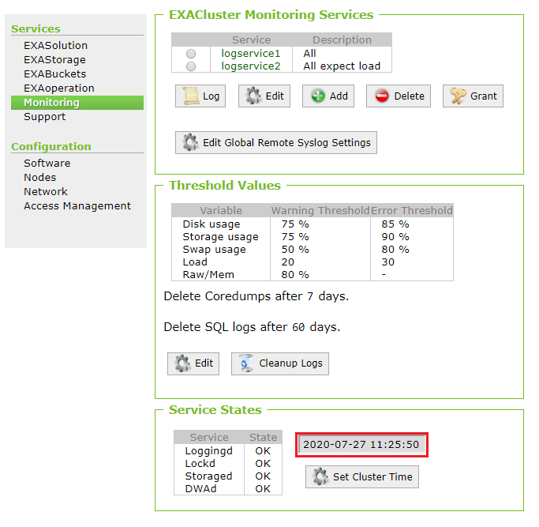
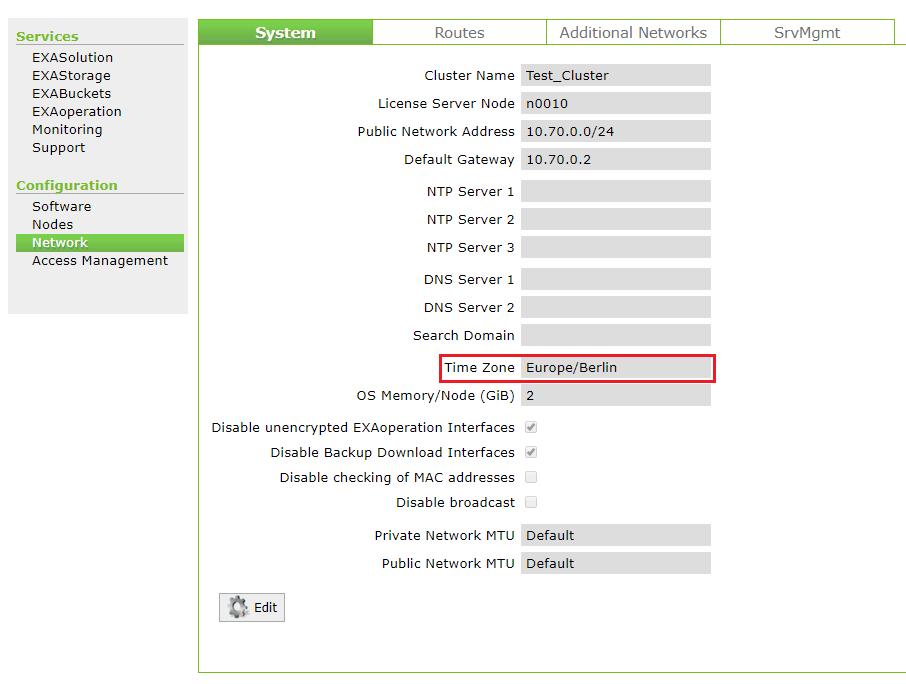
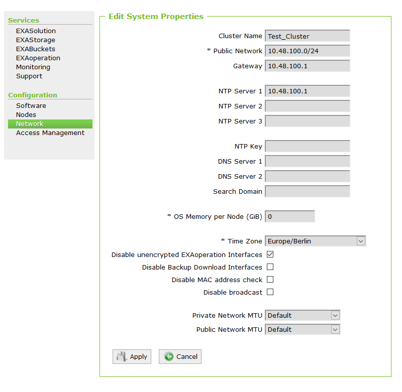
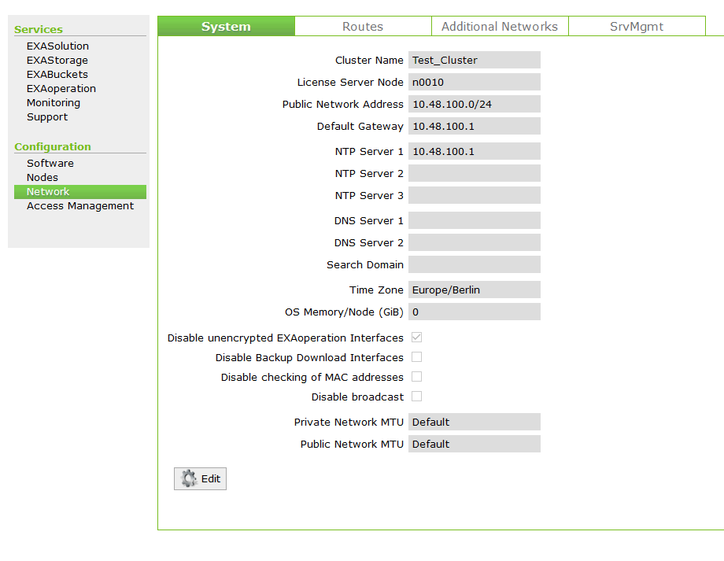
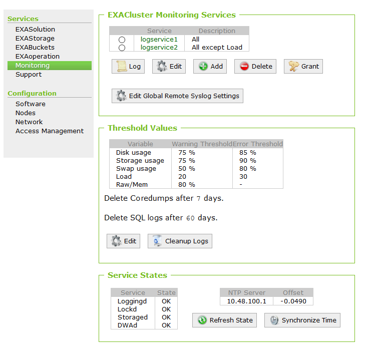

# Configuring NTP servers via EXAoperation 
## Background

This article guides you through the steps required to configure the automatic time synchronization via NTP servers on Exasol clusters.

## Prerequisites

If the time shift is greater than one hour it is required to set the time at first manually, which is described in [Manually setting time via EXAoperation](https://community.exasol.com/t5/environment-management/manually-setting-time-via-exaoperation/ta-p/1432).  
There is no downtime need if the time shift is less than one hour.

 Please note that:

1. The cluster nodes constantly exchange configuration and vitality information and depend on proper time synchronization. While it is possible to manually set the time on Exasol clusters, it is highly recommended to supply NTP servers for time synchronization.
2. The tasks performed in EXAoperation requires a user with at least "Administrator" privileges.

Please ensure that the NTP servers provided to EXAoperation

1. are connectible from the cluster (port filtering, firewalling) and
2. can be addressed by name or IP address (i.e.: hostnames must be resolvable through DNS).  
Check the gap between the currently configured time and the actual time

## Procedure

## 1.1 Check currently configured time on the cluster

* Open 'Services > Monitoring'
* Check the following value in the field:

  

* Open 'Configuration > Network'
* Check the value in the field "Time Zone"

Make a rough estimation of the mismatch. If the mismatch is greater than one hour please set the time manually, which is described in [Manually setting time via EXAoperation](https://community.exasol.com/t5/environment-management/manually-setting-time-via-exaoperation/ta-p/1432).

## 1.2 Configure NTP Server

* Open 'Configuration > Network'
* Click on "Edit"
* Add the IP-addresses of the server

* Apply the new configuration

## 1.3. Synchronize time on the cluster

* Open 'Service > Monitoring'
* Click on "Synchronize Time"

  

Now the cluster will synchronize the time with the configured NTP servers constantly.

