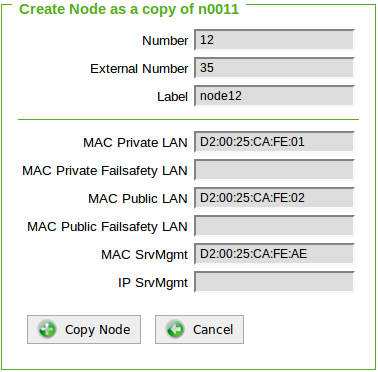

# Creating new data nodes using the copy function 
Adding data nodes to a cluster does not mean that they must be created again. If a data node has already been configured, then by going to the Nodes tab and clicking on the existing node, we can find the Copy and Multiple Copy options.

Copy button will use the current node's configuration to create a new one with the same configuration, while the Multiple Copy will create any desired number of nodes using the "master" node's configuration.

#### Multiple Copy

* Number: Represents the last octet within the private network (CICN)
* External Number: Represents the last octet within the public network (CSCN)
* Label: Optional Label
* MAC Private LAN: MAC address of the private network interface (CICN)
* MAC Private Failsafety LAN (optional)
* MAC Public LAN: MAC address of the public network interface (CSCN)
* MAC Public Failsafety LAN (optional)
* MAC SrvMgmt: MAC address of the IPMI network interface (LOM)  
**OR**
* IP SrvMgmt: IP address of the IPMI network interface (LOM)

The example shows the creation of four new nodes using the configuration of "master" node n0011

#### Copy

* Has the same configuration fields as Multiple Copy, but only for one node.

The example shows the creation of one new nodes using the configuration of "master" node n0011

