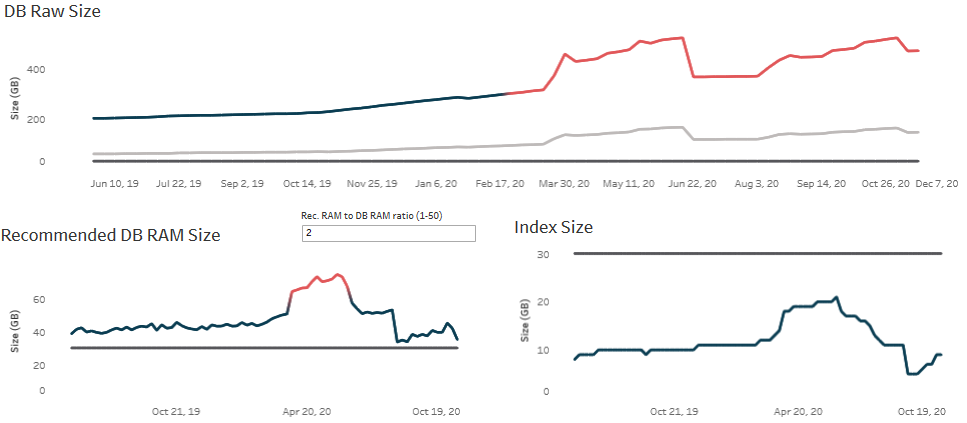
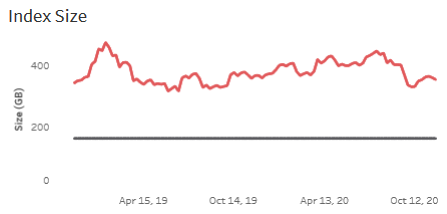
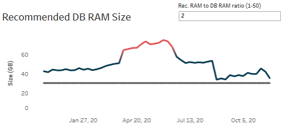
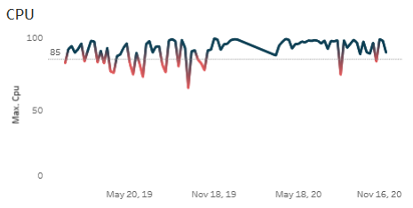
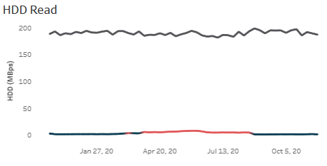
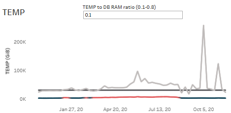
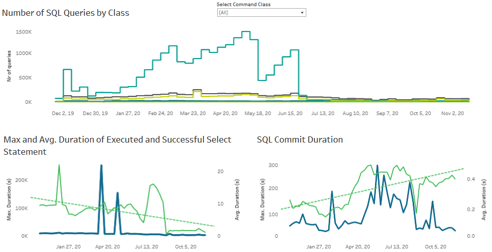
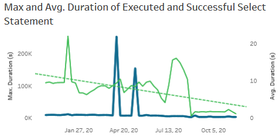
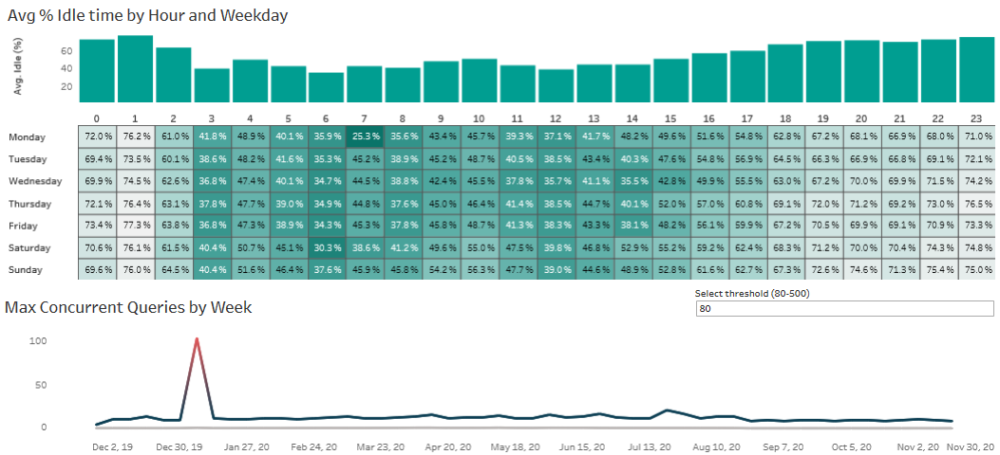

# Monitoring of an Exasol Database 
## What is this article about?

It shows how you can monitor the development of your database with regard to size, usage, hardware resources and SQL statements. At Exasol we use our customer dashboards to evaluate the progression of customer systems in these areas.In this article, we show you what the dashboards look like, on which metadata they are based and what you should pay attention to during the evaluation. A small note: We developed our dashboards on the basis of Tableau. Our goal is that this article will help you to develop your own dashboards based on the technology you prefer.

## Lets take a look at the statistic tables we need.

Exasol provides a large number of different system, metadata, and statistics tables that can be used to build a monitoring dashboard. We are now focusing on the progression of statistics over a longer period of time. The tables can of course also be used for other Monitoring Use Cases. E.g. real-time monitoring of the current database status. There are no limits to the imagination when developing new applications.

There is an overview of all system tables in our documentation here: <https://docs.exasol.com/sql_references/metadata/metadata(systemtables).htm>

Let's focus on the statistical tables: <https://docs.exasol.com/sql_references/metadata/statistical_system_table.htm#Statistical_System_Tables>

The tables that are important to us are here

* EXA_DB_SIZE_*
* EXA_MONITOR_*
* EXA_USAGE_*
* EXA_SQL_*

It is important to understand that these tables each come with 4 different levels of granularity. These include LAST_DAY, HOURLY, DAILY and MONTHLY. The EXA_SQL_LAST_DAY includes, for example, every SQL statement with the statement type, the CPU power used, the TEMP_DB_RAM generated, etc. ... at the level of transactions. Since the data is only kept for 24 hours at this granularity level, the LAST_DAY tables are not suitable for long-term monitoring - an exception would be if the tables are imported into another table on a daily basis in order to keep them here long-term. The counterpart to the EXA_SQL_LAST_DAY described above is the EXA_SQL_HOURLY. As the name suggests, the values are aggregated here on an hourly level. This means values such as CPU usage or generated TEMP_DB_RAM are provided in an AVG and a MAX value for all statement types on an hourly basis.

Which table and granularity is the right one depends entirely on the KPIs and their observation period. In the following, we show you which tables we have used for our dashboards and we will explain the respective decision on the source tables.

## How we build our dashboards

In the following, we show you 4 of our most important customer dashboards. They are about the following topics in detail:

* Database size
* Hardware usage
* SQL statements
* Concurrent Users & Queries

## Database size

Let's look at the database size dashboard. This consists of three different graphics that consider the database size, the size of the indexes and the size of the recommended RAM over a longer period of time. The dashboard is designed for a long-term view. For this reason, we decided to use EXA_DB_SIZE_DAILY as the data source, since the corresponding values are already aggregated here at the day level. In order to compare the corresponding values with the current RAM, we also use the DB_RAM_SIZE column from the EXA_SYSTEM_EVENTS table.

Source: <https://docs.exasol.com/sql_references/metadata/statistical_system_table.htm#EXA_DB_SIZE_DAILY> 

### DB SIZE diagram

Let's start with a detailed analysis of the individual graphics. The DB Size graphic shows us the development of the database size - compressed and not compressed. As well as the ratio of the size to the available RAM. 

**Data sources:** Table: EXA_DB_SIZE_DAILY - Due to the long observation period, we choose the **maximum** of the corresponding day for the columns **RAW** and **MEM_OBJECT_SIZE**. We also use the **DB_RAM_SIZE** from the EXA_SYSTEM_EVENTS table.

**Details of the graphic:** A line is drawn for the values of RAW_OBJECT_SIZE_MAX and MEM_OBJECT_SIZE_MAX. The INTERVAL_START column serves as the time factor. Due to the aggregation there is a value for each day. These values allow the database size to be analyzed over a longer period of time. Simple math makes it possible to read the average data growth over a period of time from the graph. Also peaks in the data filling or the deletion of data can be traced.

**Important:** The graphic is also used to compare the amount of raw data with the available RAM. With an in-memory database, it is very important that the hot data fit permanently in the RAM so that optimal performance can be ensured. For this reason there is the so-called **ten percent rule** - this says that ten percent of the raw data volume should fit into the RAM. Therefore, another line is drawn in the graphic for the existing RAM. So that this rule can be monitored in the graphic, the RAW_OBJECT_SIZE_MAX line turns red if the RAM is less than 10% of the RAW_OBJECT value.

### Auxiliary diagram

Similar to the previous graphic, the size of the indexes is examined and compared with the RAM.

**Data sources:** Table: EXA_DB_SIZE_DAILY. The index size is saved as the daily maximum in the column AUXILIARY_SIZE_MAX. We also use the DB_RAM_SIZE from the EXA_SYSTEM_EVENTS table.

**Details of the graphic:** Both values are shown as lines over time.

**Important:** In order to guarantee optimal performance, all indexes should fit together in the RAM. For this reason, the AUXILIARY line is displayed in red when the size exceeds the RAM.

### Recommended RAM diagram

On the basis of the current database usage, e.g. the created TEMP_DB_RAM, the database calculates an optimal amount of RAM at every point in time. This value is considered in the third graphic.

**Data sources:** Table: EXA_DB_SIZE_DAILY - RECOMMENDED_DB_RAM_SIZE_AVG (Average of the day), DB_RAM_SIZE

**Details of the graphic:** Line diagram

**Important:** The Recommended RAM_SIZE is a value estimated by the system and represents a recommendation for an ideal RAM size. Our experience has shown that the system can already be operated optimally with half this value. We have made this factor easy to maintain in the dashboard. If the RECOMMENDED_RAM_SIZE divided by FACTOR is greater than the RAM, the RECOMMENDED_RAM_SIZE is displayed in red. Our experience has shown that NOT (RECOMMENDED> 2 * RAM) turned out to be a good metric.

## Hardware usage

As a distributed in-memory database system, the performance of Exasol depends on the following four hardware components: CPU, RAM, network and hard disk access. For this reason, the following dashboard consists of four graphics, each dealing with one of these components. We use the EXA_MONITOR_DAILY table as the data source.

 

Source: [https://docs.exasol.com/sql_references/metadata/statistical_system_table.htm#EXA_MONITOR_DAILY](https://docs.exasol.com/sql_references/metadata/statistical_system_table.htm#EXA_MONITOR_DAILY "EXA_MONITOR_DAILY")

### CPU Diagram

As a MPP database an Exasol cluster has a variable number of Nodes with its own CPUs.

**Data sources:** Table EXA_MONITOR_DAILY - CPU_MAX

**Details of the graphic:** Line Diagram

**Important:** The highest possible CPU utilization is desirable. The maximum values of the day are used for this. The average value is not meaningful because IDLE times have a massive influence on the result. The goal is a maximum utilization of over 85%. If the CPU load falls below this value on a day, this is displayed in red in the diagram

### HDD read diagram

With an in-memory database, the most important data should always fit in the RAM. Whenever a data block is not in the RAM, it has to be read from the hard disk, which costs performance.

**Data sources:** Table EXA_MONITOR_DAILY - HDD_READ_AVG, HDD_READ_MAX

**Details of the graphic:** Line diagram

**Important:** The HDD_READ values should be as low as possible. We have used AVG as a window function in our BI tool to determine whether values are increasing permanently or not. This ensures that the line is displayed in red if there is a permanent incline. For a long-term view, the Average is very important because peaks can occur from time to time.

### NET diagram

If data is distributed to different Nodes, it is important to set the distribution key and use replication border (see: <https://docs.exasol.com/performance/best_practices.htm?Highlight=Best>) to avoid too many global operations. Global operations like global joins and global aggregations cannot be avoided completely. Therefore the network traffic should be monitored.

**Data sources:** Table EXA_MONITOR_DAILY - NET_AVG, NET_MAX

**Details of the graphic:** Line diagram

**Important:** For the reason mentioned above, the NET values should be as low as possible. We have used AVG as a window function in our BI tool to determine whether values are increasing permanently or not. This ensures that the line is displayed in red if there is a permanent incline.

### Temp DB RAM diagram

Every database operation generates a temporary amount of data in the RAM. If the sum of all temporarily generated data no longer fits in the RAM, this is reflected in the performance of the operations.

**Data sources:** Table EXA_MONITOR_DAILY - TEMP_DB_RAM_AVG, TEMP_DB_RAM_MAX

**Details of the graphic:** Line diagram

**Important:** For the reason mentioned above, the TEM DB RAM values should be monitored. We have used AVG as a window function in our BI tool to determine whether values are increasing permanently or not. This ensures that the line is displayed in red if there is a permanent incline.

## SQL statements

This dashboard is intended to give an overview of the average runtimes of different queries. The EXA_SQL_DAILY table is used as the data source for this.

Source: [https://docs.exasol.com/sql_references/metadata/statistical_system_table.htm#EXA_SQL_DAILY](https://docs.exasol.com/sql_references/metadata/statistical_system_table.htm#EXA_SQL_DAILY "EXA_SQL_DAILY") 

### SQL Queries by class diagram

The graphic shows over a longer timeline how many queries of a COMMAND_CLASS have been executed per day. The database operator can use this view to determine whether a change in performance can be justified, for example, by a strong increase or decrease in queries.

**Data sources:** Table **EXA_SQL_DAILY -** COUNT, COMMAND_CLASS, EXECUTION_MODE, SUCCESS

**Details of the graphic:** Line diagram

**Important:** The graphic shows differently colored lines. Each line stands for a COMMAND_CLASS. The statements are filtered on EXECUTION_MODE = 'EXECUTE' and SUCCESS*.* There is also a filter on the COMMAND_CLASS.

### Executed and successful Select Statements diagram

The following graphic gives an overview of the average and maximum duration of DQL statements.

**Data sources:**  Table **EXA_SQL_DAILY -** DURATION_AVG, DURATION_AVG

**Details of the graphic:** Line diagram

**Important:** In the BI Tool, we have placed a trend line on the development of the curves for a better overview. The Data is filtered on the COMMAND_CLASS "DQL", EXECUTION_MODE = "EXECUTE" and SUCCESS.

### Commit Duration diagram

The following graphic gives an overview of the average and maximum duration of Commit statements.

**Data sources:**  Table **EXA_SQL_DAILY -** DURATION_AVG, DURATION_AVG

**Details of the graphic:** Line diagram

**Important:** In the BI TOOL, we have placed a trend line on the development of the curves for a better overview. The Data is filtered on the COMAND_CLASS "COMMIT", EXECUTION_MODE = "EXECUTE" and SUCCESS.

## Concurrent Users & Queries

We would like to use this dashboard to provide an overview of the use of the database. In order to be able to show the usage over the different days of the week and the time of day, we use a finer granularity here. For this reason, we are accessing a _HOURLY table for the first time in this article. This is the EXA_USAGE_HOURLY table. With this table we can evaluate on an hourly basis how many queries were processed by the database at the same time or how often the database was idle.

Source: <https://docs.exasol.com/sql_references/metadata/statistical_system_table.htm#EXA_USAGE_HOURLY>

### Idle diagram

By combining the different types of diagrams, this graphic provides an insight into how the system is being used on different days and times of the week.

**Data sources:** Table EXA_USAGE_HOURLY - IDLE Column from EXA_USAGE_HOURLY

**Details of the graphic:** This graphic contains both a **bar** and a **matrix diagram**. The bar chart shows the average idle time by day of the week. The matrix diagram shows the idle time broken down into day of the week and hour of the day. To do this, the INTERVAL_START field is broken down to the weekday and hour level.

**Important:** The IDLE column indicates the percentage of the hour (EXA_USAGE_HOURLY) for which the database has no queries to process. Depending on the percentage, the field is displayed in a different color.

### Concurrent Queries diagram

The database describes in the table EXA_USAGE_LAST_DAY exactly how many queries are processed in parallel at the transaction level. For the evaluation over a longer period of time we use the table EXA_USAGE_HOURLY. This table shows the average value and the maximum for queries per hour.

**Data sources:** Table EXA_USAGE_HOURLY - QUERIES_AVG, QUERIES_MAX

**Details of the graphic:**  Line diagram

**Important:** The limit of parallel queries in Exasol is 100 by default. In the dashboard, the user has the option of specifying a limit value from which he sees the database load as critical. If this limit is exceeded, both the line for the average and the line for the maximum turn red.

## Final conclusion

This might have given you an insight how you can monitor an Exasol database in a long-term perspective. The statistical system tables DB_SIZE, MONITORING, SQL and USAGE already give you a good overview of what is happening on the system. However, there are many other system tables that are suitable for different monitoring scenarios. There are no limits to creativity here.
